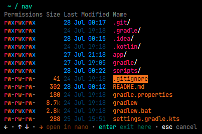
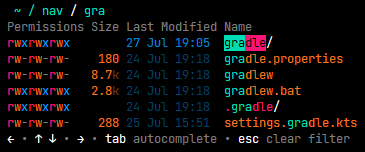

<div align="center">

# 📂 nav 📂

The interactive and stylish replacement for ls & cd!





</div>

---

[![GitHub][latest-release-badge]][latest-release]
[![GitHub][license-badge]](LICENSE.md)
[![Build][build-badge]][github-actions]
[![Checks][checks-badge]][github-actions]
[![Package][package-badge]][github-actions]

[![Kotlin Multiplatform][kotlin-multiplatform-badge]][kotlin-multiplatform]
[![Linux X64 Platform][linux-x64-platform-badge]][kotlin-native]
[![Linux ARM64 Platform][linux-arm64-platform-badge]][kotlin-native]
[![MinGW X64 Platform][mingw-x64-platform-badge]][kotlin-native]
[![JVM Platform][jvm-platform-badge]][kotlin-jvm]

[latest-release-badge]: https://img.shields.io/github/v/release/Jojo4GH/nav?label=Latest
[latest-release]: https://github.com/Jojo4GH/nav/releases/latest
[license-badge]: https://img.shields.io/github/license/Jojo4GH/nav?label=License

[build-badge]: https://img.shields.io/github/actions/workflow/status/Jojo4GH/nav/workflow.yml?branch=master&label=Build
[checks-badge]: https://img.shields.io/github/check-runs/Jojo4GH/nav/master?label=Checks
[package-badge]: https://img.shields.io/github/actions/workflow/status/Jojo4GH/nav/package.yml?branch=master&label=Package
[github-actions]: https://github.com/Jojo4GH/nav/actions

[kotlin-multiplatform-badge]: https://img.shields.io/badge/Kotlin_Multiplatform-grey?logo=kotlin
[linux-x64-platform-badge]: https://img.shields.io/badge/Native-Linux_X64-e082f3
[linux-arm64-platform-badge]: https://img.shields.io/badge/Native-Linux_ARM64-e082f3
[mingw-x64-platform-badge]: https://img.shields.io/badge/Native-MinGW_X64-e082f3
[jvm-platform-badge]: https://img.shields.io/badge/Platform-JVM-4dbb5f

[kotlin-multiplatform]: https://kotlinlang.org/docs/multiplatform.html
[kotlin-native]: https://kotlinlang.org/docs/native-overview.html
[kotlin-jvm]: https://kotlinlang.org/docs/jvm-get-started.html

Ever tried to find that one config file hidden deep in your directory tree?
Or maybe you just want to quickly jump to a directory and inspect some files on the way?  
✨ **nav** is here to help! ✨  
Written in Kotlin/Native, nav provides a modern and intuitive terminal UI to navigate your filesystem.

- ➡️ Use arrow keys to navigate everywhere
- ⌨️ Type to filter entries, press <kbd>Tab</kbd> to autocomplete
- ✏️ Instantly edit files with your favorite editor on the fly
- 📈 Create files and directories or run commands everywhere
- ✅ Press <kbd>Enter</kbd> to move your shell to the current directory
- 🔧 [Configure](#-configuration) everything to your liking
- ⭐ Define [custom macros](#-macros-experimental) for even more powerful workflows

### Contents

- [Installation](#-installation)
- [Configuration](#-configuration)
  - [General](#general)
  - [Controls](#controls)
  - [Appearance](#appearance)
- [Macros (experimental)](#-macros-experimental)
  - [Conditions](#conditions)
  - [Actions](#actions)
  - [Properties, Variables & Placeholders](#properties-variables--placeholders)
  - [Examples](#examples)
- [Entry Macros](#entry-macros)
- [Known Issues](#known-issues)

## 🚀 Installation

### 1. Install **nav**

Select your operating system

<details>
<summary>Linux</summary>

Install with any of the following package managers:

| Distribution         | Repository                                                  | Instructions                               |
|----------------------|-------------------------------------------------------------|--------------------------------------------|
| Arch Linux           | [AUR]                                                       | `pacman -S nav-cli` <br/> `yay -S nav-cli` |
| NixOS                | [Nixpkgs]                                                   | `nix-shell -p nav`                         |
| Debian, Ubuntu, etc. | [nav_amd64.deb][Deb_amd64] <br/> [nav_arm64.deb][Deb_arm64] | `dpkg -i ...`                              |

[AUR]: https://aur.archlinux.org/packages/nav-cli
[Nixpkgs]: https://search.nixos.org/packages?show=nav
[Deb_amd64]: https://github.com/Jojo4GH/nav/releases/latest/download/nav_amd64.deb
[Deb_arm64]: https://github.com/Jojo4GH/nav/releases/latest/download/nav_arm64.deb

Or install (or update) nav with the [installer script](install/install.sh):
```sh
curl -sS https://raw.githubusercontent.com/Jojo4GH/nav/master/install/install.sh | sh
```

Or manually download the [latest release](https://github.com/Jojo4GH/nav/releases/latest).

</details>

<details>
<summary>Windows</summary>

On Windows, you can use [scoop](https://scoop.sh) to install nav:

```powershell
scoop bucket add JojoIV "https://github.com/Jojo4GH/scoop-JojoIV"
scoop install nav
```

Or without adding the bucket:

```powershell
scoop install "https://raw.githubusercontent.com/Jojo4GH/scoop-JojoIV/master/bucket/nav.json"
```

</details>

### 2. Set up your shell

Configure your shell to initialize nav. This is required for the *cd* part of nav's functionality.

<details>
<summary>Bash</summary>

Add the following to the end of `~/.bashrc`:

```sh
eval "$(nav --init bash)"
```

</details>

<details>
<summary>Zsh</summary>

Add the following to the end of `~/.zshrc`:

```sh
eval "$(nav --init zsh)"
```

</details>

<details>
<summary>Powershell</summary>

Add one of the following to the end of your PowerShell configuration (find it by running `$PROFILE`):

```powershell
Invoke-Expression (& nav --init powershell | Out-String)
```

```powershell
Invoke-Expression (& nav --init pwsh | Out-String)
```

</details>

<details>
<summary>NixOS</summary>

Bash:

```nix
programs.bash.shellInit = "eval \"$(nav --init bash)\"";
```

Zsh:

```nix
programs.zsh.shellInit = "eval \"$(nav --init zsh)\"";
```

Or with `home-manager`:

```nix
home-manager.users.user.programs = {
    bash = {
        enable = true;
        bashrcExtra = "eval \"$(nav --init bash)\"";
    };
    zsh = {
        inherit (config.programs.zsh) enable;
        initExtra = "eval \"$(nav --init zsh)\"";
    };
};
```

</details>

### 3. Basic Usage

The default keybinds are:

| Key                                   | Description                          | [Configuration](#controls)                                          |
|---------------------------------------|--------------------------------------|---------------------------------------------------------------------|
| <kbd>↑</kbd>/<kbd>↓</kbd>             | Move cursor up/down                  | `keys.cursor.up`, `keys.cursor.down`                                |
| <kbd>Home</kbd>/<kbd>End</kbd>        | Move cursor to first/last            | `keys.cursor.home`, `keys.cursor.end`                               |
| <kbd>←</kbd>                          | Go up one directory                  | `keys.nav.up`                                                       |
| <kbd>→</kbd>                          | Go into directory / Open file        | `keys.nav.into`, `keys.nav.open`                                    |
| <kbd>Enter</kbd>                      | Exit and cd to directory / Submit    | `keys.submit`                                                       |
| <kbd>Esc</kbd>                        | Exit (don't cd) / Cancel             | `keys.cancel`                                                       |
| <kbd>ctrl</kbd>+<kbd>C</kbd>          | Exit                                 | -                                                                   |
| <kbd>PageUp</kbd>/<kbd>PageDown</kbd> | Open menu / Move menu cursor up/down | `keys.menu.up`, `keys.menu.down`                                    |
| <kbd>Tab</kbd>                        | Autocomplete                         | `keys.filter.autocomplete`, `autocomplete` (see [below](#controls)) |
| <kbd>Esc</kbd>                        | Clear filter or input                | `keys.filter.clear`                                                 |
| `...`                                 | Type filter or input                 | -                                                                   |
| <kbd>ctrl</kbd> + `...`               | Quick macro mode                     | See [macros](#-macros-experimental)                                 |

All available keybinds are (by default) also shown at the bottom in nav.

## 🔧 Configuration

To create or edit the config file you can use the `--edit-config` command line option.
Config files can be written in either [YAML](https://yaml.org) (recommended) or [TOML](https://toml.io) format (but not both).
The default locations for the file are `~/.config/nav.yaml`, `~/.config/nav.yml` or `~/.config/nav.toml`.
If you intend to define [macros](#macros), please use the YAML format.
You can change this by setting the `NAV_CONFIG` environment variable:

<details>
<summary>Linux</summary>

```sh
export NAV_CONFIG=~/some/other/path/nav.yaml
```

</details>

<details>
<summary>Powershell</summary>

```powershell
$ENV:NAV_CONFIG = "$HOME\some\other\path\nav.yaml"
```

</details>

You can also use the `--config` command line option to explicitly specify a config file.

The default configuration looks as follows:

### General

<details open>
<summary>YAML</summary>

```yaml
# If not specified, uses the first that exists of the following:
# $EDITOR, $VISUAL, nano, nvim, vim, vi, code, notepad
# You can also use the --editor command line option to override this
editor: null

suppressInitCheck: false
clearOnExit: true

limitToTerminalHeight: true
maxVisibleEntries: 40 # Set to 0 for unlimited entries
maxVisiblePathElements: 6
showHiddenEntries: true
hideHints: false

# Used to distinguish escape sequences on Linux terminals
inputTimeoutMillis: 4 # Set to 0 for no timeout

# Which columns to show for each entry and how to order them
shownColumns:
- Permissions       # Permissions of the entry in unix style
# - HardLinkCount   # Number of hard links to the entry (not shown by default)
# - UserName        # Name of the user owning the entry (not shown by default)
# - GroupName       # Name of the group owning the entry (not shown by default)
- EntrySize         # Size of the file
- LastModified      # Time of last modification
```

</details>

<details>
<summary>TOML</summary>

```toml
# If not specified, uses the first that exists of the following:
# $EDITOR, $VISUAL, nano, nvim, vim, vi, code, notepad
# You can also use the --editor command line option to override this
editor = "" # Default: null

suppressInitCheck = false
clearOnExit = true

limitToTerminalHeight = true
maxVisibleEntries = 20 # Set to 0 for unlimited entries
maxVisiblePathElements = 6
showHiddenEntries = true
hideHints = false

# Used to distinguish escape sequences on Linux terminals
inputTimeoutMillis = 4 # Set to 0 for no timeout

# Which columns to show for each entry and how to order them
shownColumns = [
    "Permissions",      # Permissions of the entry in unix style
    # "HardLinkCount",  # Number of hard links to the entry (not shown by default)
    # "UserName",       # Name of the user owning the entry (not shown by default)
    # "GroupName",      # Name of the group owning the entry (not shown by default)
    "EntrySize",        # Size of the file
    "LastModified",     # Time of last modification
]
```

</details>

### Controls

For valid key names see [web keyboard event values](https://developer.mozilla.org/en-US/docs/Web/API/UI_Events/Keyboard_event_key_values).

<details open>
<summary>YAML</summary>

```yaml
keys:
  submit: Enter
  cancel: Escape
  
  cursor:
    up: ArrowUp
    down: ArrowDown
    home: Home
    end: End
  
  nav:
    up: ArrowLeft
    into: ArrowRight
    open: ArrowRight
  
  menu:
    up: PageUp
    down: PageDown
  
  filter:
    autocomplete: Tab
    clear: Escape

autocomplete:
  # Controls the behavior of the auto complete feature
  # - CommonPrefixCycle: Auto completes the largest common prefix and cycles through all entries
  # - CommonPrefixStop: Auto completes the largest common prefix and stops
  style: CommonPrefixCycle
  # Controls auto navigation on completion
  # - None: Do not auto navigate
  # - OnSingleAfterCompletion: Auto completes the entry and on second action navigates
  # - OnSingle: Auto completes the entry and navigates immediately (not recommended)
  autoNavigation: OnSingleAfterCompletion
```

</details>

<details>
<summary>TOML</summary>

```toml
[keys]

submit = "Enter"
cancel = "Escape"

cursor.up = "ArrowUp"
cursor.down = "ArrowDown"
cursor.home = "Home"
cursor.end = "End"

nav.up = "ArrowLeft"
nav.into = "ArrowRight"
nav.open = "ArrowRight"

menu.up = "PageUp"
menu.down = "PageDown"

filter.autocomplete = "Tab"
filter.clear = "Escape"

[autocomplete]

# Controls the behavior of the auto complete feature
# - "CommonPrefixCycle": Auto completes the largest common prefix and cycles through all entries
# - "CommonPrefixStop": Auto completes the largest common prefix and stops
style = "CommonPrefixCycle"
# Controls auto navigation on completion
# - "None": Do not auto navigate
# - "OnSingleAfterCompletion": Auto completes the entry and on second action navigates
# - "OnSingle": Auto completes the entry and navigates immediately (not recommended)
autoNavigation = "OnSingleAfterCompletion"
```

</details>

### Appearance

<details open>
<summary>YAML</summary>

```yaml
colors:
  # Possible values for themes are:
  # - Retro (default theme)
  # - Monochrome (default simpleTheme)
  # - SimpleColor
  # - Random
  # - Sunset
  # - Xmas
  # - Hub
  # - Ice
  # - Darcula
  # - AtomOneDark
  theme: Retro
  simpleTheme: Monochrome   # Used for terminals with less color capabilities (see: accessibility.simpleColors)

  # The following colors can also be explicitly set (default: theme/simpleTheme colors):
  path: null
  filter: null
  filterMarker: null
  keyHints: null
  keyHintLabels: null
  genericElements: null
  
  permissionRead: null
  permissionWrite: null
  permissionExecute: null
  permissionHeader: null
  hardlinkCount: null
  hardlinkCountHeader: null
  user: null
  userHeader: null
  group: null
  groupHeader: null
  entrySize: null
  entrySizeHeader: null
  modificationTime: null
  modificationTimeHeader: null
  
  directory: null
  file: null
  link: null
  nameHeader: null
  nameDecorations: null

modificationTime:     # Configure how the modification time is rendered
  minimumBrightness: 0.4
  halfBrightnessAtHours: 12.0

accessibility:
  decorations: null   # Whether to use the simple color theme (default: auto)
  simpleColors: null  # Whether to show decorations (default: auto)
```

</details>

<details>
<summary>TOML</summary>

```toml
[colors]

# Possible values for themes are:
# - "Retro" (default theme)
# - "Monochrome" (default simpleTheme)
# - "SimpleColor"
# - "Random"
# - "Sunset"
# - "Xmas"
# - "Hub"
# - "Ice"
# - "Darcula"
# - "AtomOneDark"
theme = "Retro"
simpleTheme = "Monochrome"  # Used for terminals with less color capabilities (see: accessibility.simpleColors)

# The following colors can also be explicitly set (default: theme/simpleTheme colors):
path = "#FFFFFF"
filter = "#FFFFFF"
filterMarker = "#FFFFFF"
keyHints = "#FFFFFF"
keyHintLabels = "#FFFFFF"
genericElements = "#FFFFFF"

permissionRead = "#FFFFFF"
permissionWrite = "#FFFFFF"
permissionExecute = "#FFFFFF"
permissionHeader = "#FFFFFF"
hardlinkCount = "#FFFFFF"
hardlinkCountHeader = "#FFFFFF"
user = "#FFFFFF"
userHeader = "#FFFFFF"
group = "#FFFFFF"
groupHeader = "#FFFFFF"
entrySize = "#FFFFFF"
entrySizeHeader = "#FFFFFF"
modificationTime = "#FFFFFF"
modificationTimeHeader = "#FFFFFF"

directory = "#FFFFFF"
file = "#FFFFFF"
link = "#FFFFFF"
nameHeader = "#FFFFFF"
nameDecoration = "#FFFFFF"

[modificationTime]    # Configure how the modification time is rendered

minimumBrightness = 0.4
halfBrightnessAtHours = 12.0

[accessibility]

simpleColors = false  # Whether to use the simple color theme (default: auto)
decorations = false   # Whether to show decorations (default: auto)
```

</details>

## ⭐ Macros (experimental)

> [!WARNING]
> Macros are currently an experimental feature.
> They may change in future releases with no guarantees of compatibility.
> Please report any [issues](https://github.com/Jojo4GH/nav/issues/new).
> For the more limited but stable variant, see [Entry Macros](#entry-macros).

With macros, you can define small scripts that can interact with nav in various ways (see [Examples](#examples)).
They can also overwrite existing functionality to customize nav to your workflow.

Macros are available in the menu (default <kbd>PageDown</kbd>) or with their `nonQuickModeKey`.
They can also quickly be triggered by tapping <kbd>ctrl</kbd> together with or followed by their `quickModeKey`.

Currently, only the YAML configuration can be used to define macros:

<details open>
<summary>YAML</summary>

```yaml
# Defines a list of macros
# Macros are shown in the following places, if their conditions are met:
# - In key hints, if a 'key' is set and not 'hideKey'
# - In quick macro mode, if a 'quickModeKey' is set and not 'hideQuickModeKey'
# - In the menu, if a 'menuOrder' is set
macros:

- # Unique id of the macro used for referencing it (optional, default: null)
  id: null
  
  # Description of the macro shown in nav (supports placeholders, required if not hidden, default: "")
  description: ""

  # Key used to trigger the macro in normal mode (optional, default: null)
  # For valid key names see https://developer.mozilla.org/en-US/docs/Web/API/UI_Events/Keyboard_event_key_values
  key: null
  
  # Whether to hide the hint for the normal mode key (optional, default: false)
  hideKey: false
  
  # Key used to trigger the macro in quick macro mode (optional, default: null)
  # For valid key names see https://developer.mozilla.org/en-US/docs/Web/API/UI_Events/Keyboard_event_key_values
  quickModeKey: null
  
  # Whether to hide the hint for the quick mode key (optional, default: false)
  hideQuickModeKey: false
  
  # The order in which the macro appears in the menu (optional, default: null)
  # If null, the macro does not appear in the menu.
  # Lower numbers appear first.
  menuOrder: null
  
  # The condition that must be met for the macro to be available (optional, default: null, see "Conditions" below)
  # If no condition is specified, the macro is always available.
  condition:
    # ...
  
  # The actions to run when the macro is triggered (optional, default: [])
  # See "Actions" below
  run:
  - # action 1
  - # action 2
  - # ...
```

</details>

### Conditions

<details open>
<summary>YAML</summary>

```yaml
# Possible conditions are:

  # True if any child condition is true (similar to logical OR)
- any:
  - # child condition 1
  - # child condition 2
  - # ...
  
  # True if all child conditions are true (similar to logical AND)
- all:
  - # child condition 1
  - # child condition 2
  - # ...
  
  # True if the child condition is false (similar to logical NOT)
- not:
    # child condition
  
  # True if all values are equal (the values support placeholders)
- equal: [ "value 1", "value 2", ... ]
  ignoreCase: false   # Whether to ignore case when comparing (optional, default: false)

  # True if any values are not equal (the values support placeholders)
- notEqual: [ "value 1", "value 2", ... ]
  ignoreCase: false   # Whether to ignore case when comparing (optional, default: false)

  # True if the entire value matches the given regular expression
- match: "..."        # A regex pattern (required)
  in: "..."           # (supports placeholders, required)
  ignoreCase: false   # Whether to ignore case when matching (optional, default: false)

  # True if the value is empty
- empty: "..."        # (supports placeholders, required)

  # True if the value is not empty
- notEmpty: "..."     # (supports placeholders, required)

  # True if the value contains only whitespace 
- blank: "..."        # (supports placeholders, required)
  
  # True if the value does not contain only whitespace
- notBlank: "..."     # (supports placeholders, required)
```

</details>

### Actions

<details open>
<summary>YAML</summary>

```yaml
# Possible actions are:

  # If the condition is true, run the 'then' actions, otherwise run the 'else' actions.
- if:                         # A condition (required, see "Conditions")
    # ...
  then:                       # Array of actions (optional, default: [])
  - # then action 1
  - # then action 2
  - # ...
  else:                       # Array of actions (optional, default: [])
  - # else action 1
  - # else action 2
  - # ...

  # Prints the given message.
- print: "..."                # (supports placeholders, required)
  style: null                 # (optional, default: null, valid values: ["info", "success", "warning", "error"])
  debug: false                # Whether to only print in debug mode (optional, default: false)

  # Sets the given properties/variables to the given values.
  # The properties must be mutable.
  # No property/variable that is set can appear in placeholders on the value side in the same set action
  # (use multiple set actions instead).
- set:
    # name1: "value 1"        # (value supports placeholders)
    # name2: "value 2"        # ^^
    # ...

  # Runs the sub macro with the given id.
- macro: "..."                # (required)
  ignoreCondition: false      # Whether to ignore the macro's condition (optional, default: false)
  # A map of parameters to pass to the sub macro (the values supports placeholders, optional, default: null)
  # If this is null, then all currently set variables are passed to the sub macro.
  # All set parameters are available in the sub macro as variables.
  # Modifying those variables in the sub macro does not affect the parent macro.
  parameters: null
  # A map of values to capture from the sub macro (the values supports placeholders, optional, default: null)
  # The keys are the names of properties/variables to assign in the parent macro
  # The values are evaluated in the sub macro's context.
  capture: null
  # Whether to continue executing the current macro if the sub macro explicitly returns (optional, default: true)
  continueOnReturn: true

  # Runs the given command.
  # Commands are run in the directory where nav currently is (see {{directory}} placeholder).
- command: "..."              # (supports placeholders, required)
  exitCodeTo: "exitCode"      # The variable/property to store the exit code in (optional, default: "exitCode")
  # The variable/property to store the standard output in (optional, default: null)
  # If this is null, the output gets printed to the terminal.
  outputTo: null
  trimTrailingNewline: true   # Whether to trim a single trailing newline from the output (optional, default: true)
  # The variable/property to store the standard error in (optional, default: null)
  # If this is null, the error output gets printed to the terminal.
  errorTo: null

  # Opens the given file in the editor (see 'editor' configuration or '--editor' command line option).
- open: "..."                 # (supports placeholders, required)
  exitCodeTo: "exitCode"      # The variable/property to store the editor's exit code in (optional, default: "exitCode")

  # Prompts the user for input.
  # Not both 'format' and 'choices' can be specified at the same time.
  # If choices are specified, the user must select one of the choices.
  # Otherwise, the user must enter a value matching the format (if specified).
- prompt: "..."               # The message to show (supports placeholders, required)
  format: null                # A regex pattern the entire input must match (optional, default: null)
  choices: []                 # A list of choices (values support placeholders, optional, default: [])
  default: null               # The default value (supports placeholders, optional, default: null)
  resultTo: "result"          # The variable/property to store the result in (optional, default: "result")

  # Matches the entire value against the given regex pattern.
  # If it matches, the capturing groups are stored in the given properties/variables.
  # The first capturing group is stored in the first property/variable, the second in the second, etc.
- match: "..."                # A regex pattern (required)
  in: "..."                   # (supports placeholders, required)
  ignoreCase: false           # Whether to ignore case when matching (optional, default: false)
  groupsTo: []                # A list of properties/variables to store the capturing groups in (optional, default: [])

  # Explicitly returns from the current macro (but not from nav) if the value is true.
  # Any action in this macro after this action is not executed.
  # Actions in possible parent macros may still be executed.
- return: true                # (required)

  # Immediately exits nav if the value is true.
  # If no directory is specified, nav exits at the working directory it was started from.
- exit: true                  # (required)
  at: null                    # The directory to exit at (supports placeholders, optional, default: null)
```

</details>

### Properties, Variables & Placeholders

Many strings in macros support placeholders that get replaced with their respective values when the macro is run.
Placeholders are specified by surrounding the name with **double** curly braces, e.g. `{{myVariable}}`.
They can appear multiple times in a string and anywhere inside the string.
Placeholders are replaced once (no recursive replacement).
Currently, there is no escaping mechanism for placeholders.

There are several built-in properties, some of which can be modified to affect nav's behavior:

| Name                   | Mutable | Description                                                                                                           |
|------------------------|:-------:|-----------------------------------------------------------------------------------------------------------------------|
| `workingDirectory`     |    ❌    | The working directory of nav's process                                                                                |
| `startingDirectory`    |    ❌    | The directory where nav was started (i.e. the directory specified in the command line)                                |
| `shell`                |    ❌    | The shell that nav currently uses (see `--shell`)                                                                     |
| `debugMode`            |    ❌    | Whether nav is currently running in debug mode                                                                        |
| `directory`            |    ✅    | The current directory inside nav                                                                                      |
| `entryPath`            |    ❌    | The path of the currently highlighted entry or empty if no entry is highlighted.                                      |
| `entryName`            |    ❌    | The name of the currently highlighted entry or empty if no entry is highlighted.                                      |
| `entryType`            |    ❌    | The type of the currently highlighted entry.<br>Possible values are `directory`, `file`, `link`, `unknown` and empty. |
| `entryCursorPosition`  |    ✅    | The index of the currently highlighted entry relative to all filtered entries                                         |
| `menuCursorPosition`   |    ✅    | The index of the currently highlighted menu item                                                                      |
| `filter`               |    ✅    | The current filter string or empty if no filter is set                                                                |
| `filteredEntriesCount` |    ❌    | The number of entries currently matching the filter                                                                   |
| `command`              |    ✅    | The currently typed command or empty if no command is typed                                                           |

Any environment variable can be accessed and modified as well by using the prefix `env:`, e.g. `{{env:HOME}}`.

Additionally, macros can define their own mutable variables that can be used in placeholders.

### Examples

<details open>
<summary>YAML</summary>

```yaml
macros:

# Open the current directory in code (Trigger: ctrl+ArrowUp)
- description: open in code
  key: ctrl+ArrowUp
  hideKey: true
  run:
  - command: code "{{directory}}"

# Open the current entry in code (Trigger: ctrl+ArrowRight)
- description: open {{entryName}} in code
  quickModeKey: ArrowRight
  condition:
    notEmpty: "{{entryName}}"                       # Only if an entry is selected
  run:
  - command: code "{{entryName}}"

# Overwrite the default behavior of ArrowRight to open PDF files in the browser instead of the editor
- description: open pdf in browser
  key: ArrowRight
  condition:
    all:
    - equal: [ "{{entryType}}", "file" ]            # Must be a file
    - match: ".*\\.pdf"                             # Check if it ends with .pdf
      in: "{{entryName}}"
      ignoreCase: true
  run:
  - command: chromium "{{entryPath}}"

# Rename the current entry (Trigger: F6)
- description: rename {{entryName}}
  key: F6
  condition:
    notEmpty: "{{entryName}}"
  run:
  - prompt: "New name:"
    format: "[^\\/:*?\"<>|]+"                       # Valid filename characters on most systems
    default: "{{entryName}}"
    resultTo: newName
  - command: mv "{{entryName}}" "{{newName}}"

# Delete the current entry (non-empty directories only after confirmation) (Trigger: Delete)
- description: delete {{entryName}}
  key: Delete
  condition:
    notEmpty: "{{entryName}}"
  run:
  - if:                                             # Perform special checks for directories
      equal: [ "{{entryType}}", "directory" ]       
    then:
    - command: ls -A "{{entryPath}}"                # Get directory contents
      outputTo: "directoryContents"
    - if:
        notBlank: "{{directoryContents}}"           
      then:
      - prompt: "Are you sure you want to delete non-empty directory '{{entryName}}'?"
        choices: [ "Yes", "No" ]                    # Confirm if directory is not empty
        default: "Yes"
        resultTo: "confirmation"
      - if:
          notEqual: [ "{{confirmation}}", "Yes" ]   # Check if confirmed
        then:
        - return: true                              # Return from macro if not confirmed
  - command: rm -rf "{{entryPath}}"                 # Delete

# Navigate to the home directory if not already there (Trigger: ctrl+Home)
- description: home
  quickModeKey: Home
  condition:
    notEqual: [ "{{directory}}", "{{env:HOME}}" ]   # or "{{env:USERPROFILE}}" on Windows
  run:
  - set:
      directory: "{{env:HOME}}"                     # or "{{env:USERPROFILE}}" on Windows

# Create a hardlink of the current file (Trigger: Select from menu)
- description: Create hardlink of {{entryName}}
  menuOrder: 10
  condition:
    equal: [ "{{entryType}}", "file" ]              # Only for files
  run:
  - prompt: "Link path:"
    format: ".+"                                    # Not empty
    default: "/data/temp/"                          # Pre-fill with /data/temp/
    resultTo: linkPath
  - command: mkdir -p "$(dirname '{{linkPath}}')"   # Create parent directories
  - command: ln "{{entryPath}}" "{{linkPath}}"      # Create the hardlink
```

</details>

## Entry Macros

> [!NOTE]
> Entry macros will be superseded by [Macros](#-macros-experimental) in the future.

You can define custom macros that work with entries (e.g. directories, files) in the configuration file as follows:

<details>
<summary>YAML</summary>

```yaml
entryMacros:
- # The description displayed (required) (see placeholders)
  description: ...
  # The conditions for the macro to be available (defaults to false)
  onFile: false
  onDirectory: false
  onSymbolicLink: false
  # The command to run (required) (see placeholders)
  command: ...
  # What to do after the command was executed. Possible values are:
  # - DoNothing: Do nothing
  # - ExitAtCurrentDirectory: Exit at the current directory
  # - ExitAtInitialDirectory: Exit at the initial directory
  afterCommand: ...            # Defaults to DoNothing
  afterSuccessfulCommand: ...  # Defaults to value of afterCommand
  afterFailedCommand: ...      # Defaults to value of afterCommand
  # The key to trigger the macro or null for no quick macro (defaults to null)
  quickMacroKey: ...
```

</details>

<details>
<summary>TOML</summary>

```toml
[[entryMacros]]
# The description displayed (required) (see placeholders)
description = "..."
# The conditions for the macro to be available (defaults to false)
onFile = false
onDirectory = false
onSymbolicLink = false
# The command to run (required) (see placeholders)
command = "..."
# What to do after the command was executed. Possible values are:
# - "DoNothing": Do nothing
# - "ExitAtCurrentDirectory": Exit at the current directory
# - "ExitAtInitialDirectory": Exit at the initial directory
afterCommand = "..."            # Defaults to "DoNothing"
afterSuccessfulCommand = "..."  # Defaults to value of afterCommand
afterFailedCommand = "..."      # Defaults to value of afterCommand
# The key to trigger the macro or null for no quick macro (defaults to null)
quickMacroKey = "..."
```

</details>

There are several placeholders available for `description` and `command`:
- `{initialDir}`: The initial directory where nav was started
- `{dir}`: The current directory inside nav
- `{entryPath}`: The path of the currently highlighted entry
- `{entryName}`: The name of the currently highlighted entry
- `{filter}`: The current filter string or empty if no filter is set

Macros are available in the menu (default <kbd>PageDown</kbd>).
They can also quickly be triggered by tapping <kbd>ctrl</kbd> together with or followed by the `quickMacroKey`.

Examples:

<details>
<summary>YAML</summary>

```yaml
entryMacros:

- # An alternative editor macro
  description: open {entryName} in code
  command: code '{entryPath}'
  afterSuccessfulCommand: ExitAtCurrentDirectory
  onFile: true
  onDirectory: true
  quickMacroKey: ArrowRight
  
- # Same as above, but waits for the editor to close before returning again to nav
  description: open {entryName} in code and wait
  command: code --wait '{entryPath}'
  onFile: true
  onDirectory: true
  quickMacroKey: shift+ArrowRight
  
- # A macro for deleting directories recursively
  description: delete {entryName} recursively
  command: rm -rf '{entryPath}'
  onDirectory: true
  quickMacroKey: Delete
  
- # A macro for printing the full path of the entry
  description: print full path
  command: echo '{entryPath}'
  onFile: true
  onDirectory: true
  onSymbolicLink: true
```

</details>

<details>
<summary>TOML</summary>

```toml
# An alternative editor macro
[[entryMacros]]
description = "open {entryName} in code"
command = "code '{entryPath}'"
afterSuccessfulCommand = "ExitAtCurrentDirectory"
onFile = true
onDirectory = true
quickMacroKey = "ArrowRight"

# Same as above, but waits for the editor to close before returning again to nav
[[entryMacros]]
description = "open {entryName} in code and wait"
command = "code --wait '{entryPath}'"
onFile = true
onDirectory = true
quickMacroKey = "shift+ArrowRight"

# A macro for deleting directories recursively
[[entryMacros]]
description = "delete {entryName} recursively"
command = "rm -rf '{entryPath}'"
onDirectory = true
quickMacroKey = "Delete"

# A macro for printing the full path of the entry
[[entryMacros]]
description = "print full path"
command = "echo '{entryPath}'"
onFile = true
onDirectory = true
onSymbolicLink = true
```

</details>

## Known Issues

- On Windows some symbolic link destinations can not be resolved correctly.
- On Windows special characters in paths may lead invalid file information being returned or errors ([#22](https://github.com/Jojo4GH/nav/issues/22), [#24](https://github.com/Jojo4GH/nav/pull/24)).  
  This can be fixed by enabling `Settings` -> `Language & region` -> `Administrative language settings` -> `Change system locale...` -> `Use Unicode UTF-8 for worldwide language support`

## ❤️ Powered by

- UI: [Mordant](https://github.com/ajalt/mordant)
- CLI: [Clikt](https://github.com/ajalt/clikt)
- Commands: [Kommand](https://github.com/kgit2/kommand)
- Config file: [kotlinx.serialization](https://github.com/Kotlin/kotlinx.serialization), [ktoml](https://github.com/orchestr7/ktoml), [kaml](https://github.com/charleskorn/kaml)
- Kotlin/Native
